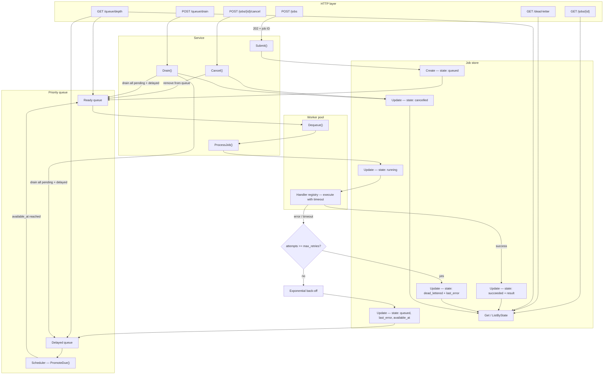
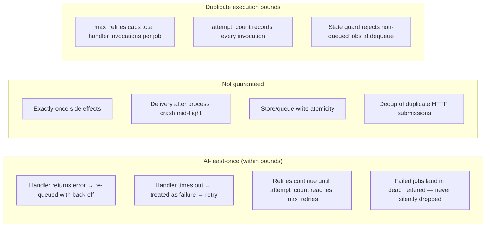

# Job Queue REST API

Production-ready asynchronous job queue with a REST API, priority scheduling, configurable retries with exponential back-off, dead-letter handling, and operational controls.

## Features

- **Async job submission** — `POST /jobs` returns a job ID immediately (`202 Accepted`); workers process jobs in the background
- **Configurable scheduling** — priority, max retries, and per-attempt timeout per job
- **Pluggable handlers** — register job types with custom execution logic
- **Retry with exponential back-off** — transient failures are re-queued with increasing delay
- **Dead-letter store** — jobs that exhaust retries move to `dead_lettered` state (never silently dropped)
- **Full lifecycle visibility** — state, attempt count, last error, and result payload via `GET /jobs/{id}`
- **Operational controls** — queue depth, drain pending jobs, cancel individual queued jobs

## Setup

### Prerequisites

- **Go 1.22+** (uses Go 1.22 `ServeMux` method routing)
- **curl** or any HTTP client for smoke tests

### Install and run

```bash
git clone <repo-url> jobqueue   # or cd into an existing checkout
cd jobqueue
go mod tidy
go run ./cmd/server
```

The server starts on `:8080` by default and launches four background workers plus a delayed-job scheduler.

### Build a binary

```bash
go build -o bin/jobqueue ./cmd/server
./bin/jobqueue
```

### Verify the installation

```bash
# Health
curl -s http://localhost:8080/health

# Submit a job
curl -s -X POST http://localhost:8080/jobs \
  -H 'Content-Type: application/json' \
  -d '{"type":"echo","payload":{"message":"hello"}}'

# Check queue depth
curl -s http://localhost:8080/queue/depth
```

A healthy deployment returns `{"status":"ok"}` from `/health`, `202 Accepted` with a job ID from `POST /jobs`, and a depth response showing pending/running counts.

### Environment configuration

All settings are read from environment variables at startup. Example for local development:

```bash
export ADDR=":8080"
export WORKER_COUNT=8
export DEFAULT_TIMEOUT=60s
export DEFAULT_MAX_RETRIES=5
export BACKOFF_BASE=2s
export BACKOFF_MAX=10m
export SCHEDULER_INTERVAL=50ms

go run ./cmd/server
```

For production, inject these via your process manager (systemd, Kubernetes, Docker Compose, etc.) rather than shell exports.

### Register custom handlers

Built-in types are registered in `internal/handler/registry.go`. Add new job types before starting the server:

```go
handlers.Register("send-email", func(ctx context.Context, payload json.RawMessage) (json.RawMessage, error) {
    // parse payload, call external service, respect ctx cancellation
    return json.Marshal(map[string]string{"status": "sent"})
})
```

Wire the registry in `cmd/server/main.go` if you create handlers in a separate package.

## Configuration

| Environment Variable   | Default  | Description                          |
|------------------------|----------|--------------------------------------|
| `ADDR`                 | `:8080`  | HTTP listen address                  |
| `WORKER_COUNT`         | `4`      | Number of concurrent workers         |
| `DEFAULT_MAX_RETRIES`  | `3`      | Default retry limit                  |
| `DEFAULT_TIMEOUT`      | `30s`    | Default per-attempt timeout          |
| `DEFAULT_PRIORITY`     | `0`      | Default job priority                 |
| `BACKOFF_BASE`         | `1s`     | Base delay for exponential back-off  |
| `BACKOFF_MAX`          | `5m`     | Maximum back-off delay               |
| `SCHEDULER_INTERVAL`   | `100ms`  | Delayed-job promotion interval       |
| `SHUTDOWN_TIMEOUT`     | `30s`    | Graceful shutdown timeout            |

## Worker Configuration

Workers are goroutines that pull job IDs from the ready queue and invoke `ProcessJob`. They are independent of the HTTP server — submission returns immediately while workers drain the queue in the background.

### How workers are sized

`WORKER_COUNT` sets the size of the pool started in `cmd/server/main.go`:

```
WORKER_COUNT=4  →  four concurrent handler executions at most
```

Each worker follows a simple loop: **dequeue → load job from store → run handler with timeout → persist result or re-queue on failure**.

| Variable | Role |
|----------|------|
| `WORKER_COUNT` | Upper bound on parallel job executions |
| `DEFAULT_TIMEOUT` | Per-attempt ceiling; a slow handler blocks one worker until timeout or completion |
| `SCHEDULER_INTERVAL` | How often delayed (back-off) jobs are promoted to the ready queue |
| `BACKOFF_BASE` / `BACKOFF_MAX` | Control retry spacing; higher values reduce worker load after failures |
| `SHUTDOWN_TIMEOUT` | Time allowed for in-flight jobs to finish during graceful shutdown |

### Sizing guidelines

Use this rule of thumb when choosing `WORKER_COUNT`:

```
WORKER_COUNT ≈ target_throughput × average_handler_duration
```

Examples:

| Workload | Handler duration | Suggested `WORKER_COUNT` |
|----------|------------------|--------------------------|
| Fast I/O (HTTP callbacks) | 100–500 ms | 8–32 |
| CPU-bound transforms | 1–5 s | 4–8 (≈ CPU core count) |
| Long polls / batch jobs | 30 s+ | 2–4; lower timeout or split work |

**Do not** set `WORKER_COUNT` far above what your handlers can sustain — excess workers compete for CPU and memory without increasing throughput. If handlers call external APIs, also respect downstream rate limits.

### Per-job overrides

Individual jobs can override defaults at submission time:

```json
{
  "type": "sleep",
  "payload": {"duration": "2s"},
  "priority": 100,
  "max_retries": 5,
  "timeout_per_attempt": "10s"
}
```

- **`priority`** — higher values dequeue first; use for urgent work under contention.
- **`max_retries`** — caps total attempts for this job (see [At-Least-Once Semantics](#at-least-once-semantics)).
- **`timeout_per_attempt`** — prevents a single bad job from holding a worker indefinitely.

### Scheduler and delayed jobs

When a handler fails, the job enters the **delayed queue** with an `available_at` timestamp computed by exponential back-off. A background scheduler (`RunScheduler`) promotes due jobs back to the ready queue every `SCHEDULER_INTERVAL`.

Under heavy retry load, lower `SCHEDULER_INTERVAL` (e.g. `50ms`) reduces promotion latency at the cost of slightly more CPU. Raise `BACKOFF_MAX` to prevent retry storms from saturating workers.

### Graceful shutdown

On `SIGINT` / `SIGTERM` the server:

1. Stops accepting new HTTP connections
2. Closes the queue (workers finish current jobs, no new dequeues)
3. Waits up to `SHUTDOWN_TIMEOUT` for in-flight handlers to complete

Plan `SHUTDOWN_TIMEOUT` ≥ your longest expected `timeout_per_attempt` so jobs are not cut off mid-flight during deploys.

## Handling High Load

The in-memory single-node deployment handles moderate throughput. Under sustained or bursty load, combine operational tuning with architectural changes.

### Monitor queue pressure

`GET /queue/depth` is the primary backpressure signal:

```json
{
  "pending": 500,
  "delayed": 120,
  "running": 8,
  "dead_lettered": 3,
  "total_active": 628
}
```

| Signal | Interpretation | Action |
|--------|----------------|--------|
| `pending` growing steadily | Workers cannot keep up with submit rate | Increase `WORKER_COUNT` or scale horizontally |
| `running == WORKER_COUNT` sustained | Pool fully saturated | Add workers or reduce per-job duration |
| `delayed` large after an outage | Retry backlog building | Temporarily raise workers; inspect `last_error` on dead-lettered jobs |
| `dead_lettered` climbing | Systemic handler or dependency failure | Fix root cause before draining/replaying |

Poll depth from your monitoring stack (Prometheus scraper, health sidecar, etc.) and alert when `pending` or `total_active` exceeds a threshold for more than a few minutes.

### Tune for throughput

1. **Increase workers** — raise `WORKER_COUNT` until `running` plateaus below the cap or CPU saturates.
2. **Shorten handler work** — split large payloads into smaller jobs; avoid unbounded loops inside handlers.
3. **Use priority** — assign higher `priority` to user-facing or SLA-critical jobs so they are not starved by bulk backfill.
4. **Tighten timeouts** — lower `timeout_per_attempt` for fast-fail on hung dependencies, freeing workers sooner.
5. **Adjust back-off** — increase `BACKOFF_BASE` when downstream is rate-limited to avoid retry amplification.

### Submission-side backpressure

The API always accepts jobs (`202 Accepted`) and does not apply rate limiting internally. Callers that outpace worker capacity will see growing `pending` depth.

Recommended patterns at high load:

- **Client-side throttling** — limit concurrent submissions based on observed queue depth.
- **Admission control** — reject or shed load when `GET /queue/depth` reports `pending` above a ceiling (implement at a gateway or extend the submit handler).
- **Bulk enqueue with pacing** — batch submissions with sleeps between batches rather than unbounded parallel POSTs.

### Failure storms and retry amplification

When a shared dependency fails, every in-flight job may retry with back-off, temporarily doubling queue pressure (`delayed` + `pending`). Mitigations:

- Set **`max_retries`** conservatively for non-critical jobs.
- Raise **`BACKOFF_BASE`** / **`BACKOFF_MAX`** to spread retries over time.
- Monitor **`GET /dead-letter`** and alert on spikes — dead-lettered jobs indicate sustained failure, not transient blips.
- Use **`POST /queue/drain`** only during controlled maintenance; it cancels pending work rather than completing it.

### Scaling beyond a single node

The default in-memory queue and store do not share state across processes. Horizontal scaling requires durable backends:

| Component | Single-node (default) | High-load / multi-node |
|-----------|----------------------|-------------------------|
| Queue | In-memory heap | Redis Streams, SQS, NATS JetStream |
| Job store | In-memory map | PostgreSQL, Redis |
| Workers | `WORKER_COUNT` per process | N replicas × workers each |
| Scheduler | One goroutine per process | Leader-elected or broker-native delayed delivery |

Run multiple server instances behind a load balancer for **submission and status APIs**; run dedicated worker processes (or the same binary with workers only) that pull from the shared queue. Ensure handlers remain **idempotent** — multi-node execution increases the chance of duplicate attempts (see [At-Least-Once Semantics](#at-least-once-semantics)).

### Capacity planning checklist

- [ ] `WORKER_COUNT` sized to handler duration and available CPU
- [ ] `DEFAULT_TIMEOUT` and per-job timeouts match p99 handler latency
- [ ] Alerts on `pending`, `delayed`, and `dead_lettered` from `/queue/depth`
- [ ] Back-off tuned to protect downstream services during failures
- [ ] Durable queue + store for multi-instance deployments
- [ ] Idempotent handlers for all job types subject to retry
- [ ] Graceful deploys with `SHUTDOWN_TIMEOUT` ≥ max handler timeout

## API Reference

### Submit a job

```bash
curl -s -X POST http://localhost:8080/jobs \
  -H 'Content-Type: application/json' \
  -d '{
    "type": "echo",
    "payload": {"message": "hello"},
    "priority": 10,
    "max_retries": 3,
    "timeout_per_attempt": "30s"
  }'
```

Response (`202 Accepted`):

```json
{
  "id": "550e8400-e29b-41d4-a716-446655440000",
  "type": "echo",
  "state": "queued",
  "priority": 10,
  "max_retries": 3,
  "timeout_per_attempt": "30s",
  "attempt_count": 0,
  "created_at": "2026-06-23T12:00:00Z",
  "updated_at": "2026-06-23T12:00:00Z"
}
```

### Get job status

```bash
curl -s http://localhost:8080/jobs/{id}
```

Job states: `queued`, `running`, `succeeded`, `failed`, `dead_lettered`, `cancelled`

### Queue depth

```bash
curl -s http://localhost:8080/queue/depth
```

```json
{
  "pending": 5,
  "delayed": 2,
  "running": 1,
  "dead_lettered": 0,
  "total_active": 8
}
```

### Cancel a queued job

```bash
curl -s -X POST http://localhost:8080/jobs/{id}/cancel
```

### Drain the queue

Cancels all pending and delayed jobs:

```bash
curl -s -X POST http://localhost:8080/queue/drain
```

### List dead-lettered jobs

```bash
curl -s http://localhost:8080/dead-letter
```

### Health check

```bash
curl -s http://localhost:8080/health
```

## Built-in Job Handlers

| Type    | Description                                      |
|---------|--------------------------------------------------|
| `echo`  | Returns the input payload as the result          |
| `sleep` | Sleeps for `{"duration": "2s"}` then completes   |

See [Register custom handlers](#register-custom-handlers) in Setup to add new types.

## Architecture

### Job lifecycle



| Stage | State in store | Queue location |
|-------|----------------|----------------|
| Submitted | `queued` | Ready queue (or Delayed if back-off pending) |
| Picked up by worker | `running` | — |
| Handler succeeds | `succeeded` (+ result payload) | — |
| Handler fails, retries remain | `queued` (+ last_error, new `available_at`) | Delayed queue |
| Retries exhausted | `dead_lettered` (+ last_error) | — |
| Cancelled / drained | `cancelled` | Removed from queue |

### Component overview

```
HTTP API ──► Service ──► Priority Queue ──► Worker Pool
                │                              │
                ▼                              ▼
            Job Store ◄────────────────── Handler Registry
                │
                └── dead_lettered jobs
```

- **Priority queue** — higher priority jobs dequeued first; equal priority uses FIFO
- **Delayed queue** — failed jobs re-enqueued with back-off until `available_at`
- **Scheduler** — promotes due delayed jobs back to the ready queue
- **Graceful shutdown** — SIGINT/SIGTERM stops accepting work, drains workers, shuts down HTTP

## At-Least-Once Semantics

This system targets **at-least-once execution** for accepted jobs: a job that enters the queue will be attempted by a worker unless it is cancelled, drained, or moved to the dead-letter store. It does **not** provide exactly-once delivery or side-effect deduplication.

### Guarantee map



### Where at-least-once holds

| Scenario | Behavior |
|----------|----------|
| **Explicit handler failure** | Handler returns an error → job returns to `queued`, is placed in the delayed queue with exponential back-off, and will be dequeued again. |
| **Per-attempt timeout** | `context.WithTimeout` cancels the attempt; the error follows the same retry path as a handler failure. |
| **Retry budget** | Each invocation increments `attempt_count` before the handler runs. Retries continue while `attempt_count < max_retries`. |
| **Exhausted retries** | Job transitions to `dead_lettered` in the store and is listed via `GET /dead-letter` — it is never discarded silently. |
| **Accepted submission** | `POST /jobs` persists the job (`state: queued`) and enqueues it before returning `202`. The caller receives a durable job ID immediately. |

### Where at-least-once does not hold

| Gap | What happens | Mitigation in production |
|-----|--------------|--------------------------|
| **Non-transactional submit** | `store.Create` and `queue.Enqueue` are separate steps. A crash between them leaves a `queued` job in the store that is not in the in-memory queue. | Use a transactional outbox or a durable queue (Redis/Postgres) with atomic enqueue + persist. |
| **Crash during execution** | Worker sets `state: running`, then runs the handler. A hard crash leaves the job in `running` with no queue entry — it will not be retried automatically. | Lease/heartbeat with stale-`running` recovery, or a crash-safe durable queue with visibility timeout (SQS-style). |
| **Crash after success, before persist** | Handler completes but the process dies before `state: succeeded` is written. The job may be retried on recovery, causing **duplicate side effects**. | Idempotent handlers; write results with compare-and-set; use an external idempotency key. |
| **Crash after failure, before re-enqueue** | `handleFailure` updates the store to `queued` but crashes before `queue.Enqueue`. Job is orphaned in the store. | Same as submit gap — durable queue + reconciliation loop. |
| **Duplicate HTTP submissions** | Each `POST /jobs` creates a new job ID. Identical payloads are independent jobs. | Clients supply an idempotency key; deduplicate at submit time in the store. |
| **In-memory durability** | Queue and store are process-local. Restart loses queued work not yet persisted, and orphans persisted work not in the queue. | Replace in-memory backends with durable storage (see Production Notes). |

### How duplicate execution is bounded and detected

**Bounded by retry cap**

`max_retries` is a hard ceiling on handler invocations per job. With `max_retries: 3`, the handler runs at most three times — once per attempt — before the job is dead-lettered.

```
attempt 1 → fail → back-off → attempt 2 → fail → back-off → attempt 3 → fail → dead_lettered
```

**Detected via job record**

Callers inspect a single job ID to understand execution history:

| Field | Purpose |
|-------|---------|
| `attempt_count` | Number of times the handler has been invoked for this job |
| `state` | Current lifecycle phase (`queued`, `running`, `succeeded`, `dead_lettered`, `cancelled`) |
| `last_error` | Error from the most recent failed attempt |
| `result` | Payload written only on terminal success |

**State guard at pickup**

Before executing, `ProcessJob` loads the job from the store and proceeds only if `state == queued`:

```go
if job.State != domain.StateQueued {
    return  // already running, succeeded, dead-lettered, or cancelled
}
```

This prevents a stale queue entry from re-invoking a job that has already moved to a terminal or in-flight state. It does **not** prevent duplicate side effects when the handler succeeded but the success write was lost (see crash gap above).

**No cross-job deduplication**

The system does not compare payloads or enforce idempotency keys across separate job IDs. Duplicate execution detection is **per job ID**, not global.

### Guidance for handler authors

Because retries and crash recovery can invoke a handler more than once, handlers should be **idempotent** or guarded with external idempotency tokens (e.g. a DB unique constraint on `(job_id, attempt)` or a business-key upsert). Side effects that cannot be safely repeated — sending email, charging a card — should record progress in a durable store before returning success.

## Tests

```bash
go test ./... -cover
```

### Test layout

| Package | Type | Coverage |
|---------|------|----------|
| `internal/store` | Unit | CRUD, duplicate create, not-found, list/count by state, copy semantics |
| `internal/queue` | Unit | Priority order, FIFO by `available_at`, delayed promotion, drain, remove, close, context cancel |
| `internal/handler` | Unit | Registry, echo/sleep handlers, invalid payload, context timeout |
| `internal/worker` | Unit | Exponential back-off, pool processing, concurrent workers, graceful stop |
| `internal/service` | Unit | Submit, process, retry, dead-letter, cancel, drain, depth, scheduler, state guard, timeout |
| `internal/api` | Unit | All HTTP endpoints, validation errors, middleware recovery/logging |
| `internal/api` (`integration_test.go`) | Integration | Full lifecycle with worker pool + scheduler: success, retry→success, retry→dead-letter, priority, cancel, drain, load, timeout |

Integration tests spin up the real router, service, queue, scheduler, and worker pool — the same components wired in `cmd/server/main.go`.

## Production Notes

The default in-memory store and queue are suitable for single-node deployments and development. For multi-node production, swap `store.MemoryStore` and `queue.Queue` for Redis or PostgreSQL implementations behind the same interfaces in `internal/store` and `internal/queue`.
